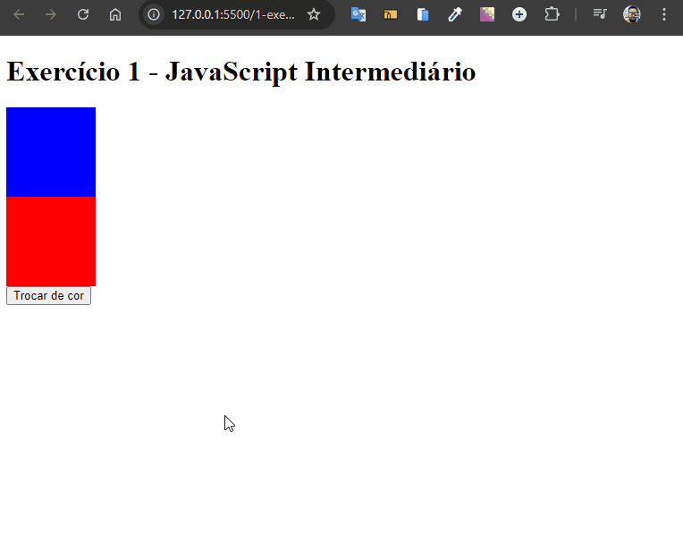

# Troca Cor Quadrados

Desenvolvido como exercício de JavaScript intermediário do curso de extensão universitária do DevQuest - Dev em Dobro.

Este projeto é uma aplicação simples em JavaScript que altera a cor do quadrado de cima ao clicar no botão. O objetivo é praticar a manipulação do DOM e eventos de clique, utilizando HTML, CSS e JavaScript.



## Tecnologias Utilizadas

- **HTML**
- **CSS**
- **JavaScript**

## Como Usar

1. Clone este repositório:

   ```bash
   git clone https://github.com/Alberesbass/troca-cor-quadrados.git
   ```

2. Abra o arquivo `index.html` em seu navegador e clique nos quadrados para alterar as cores.

## Licença

Este projeto está sob a licença MIT. Consulte o arquivo [LICENSE](./LICENSE) para mais informações.

---

Desenvolvido por [Alberes](https://github.com/Alberesbass)

---